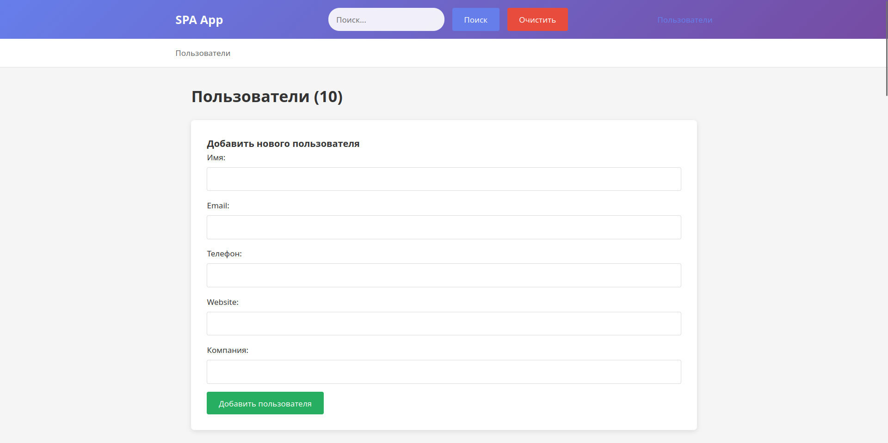

# Single Page Application (SPA) - JSONPlaceholder Client

Веб-приложение для взаимодействия с тестовым API JSONPlaceholder, построенное по принципу Single Page Application (SPA).

# главная страница 

## 📁 Структура проекта

.
├── components/ # Компоненты приложения
│ ├── breadcrumbs.js # Навигационные хлебные крошки
│ ├── comments.js # Компонент комментариев
│ ├── header.js # Шапка приложения
│ ├── posts.js # Компонент постов
│ ├── todos.js # Компонент задач
│ └── users.js # Компонент пользователей
├── docs/ # Документация
│ └── images/ # Изображения для документации
├── utils/ # Вспомогательные модули
│ ├── api.js # API-клиент для работы с JSONPlaceholder
│ └── router.js # Маршрутизатор для SPA
├── index.html # Главный HTML файл
├── script.js # Основной JavaScript файл
├── style.css # Стили приложения
└── README.md # Документация проекта

## 📄 Лицензия

Этот проект распространяется под лицензией MIT. Подробнее см. в файле [LICENSE](LICENSE).